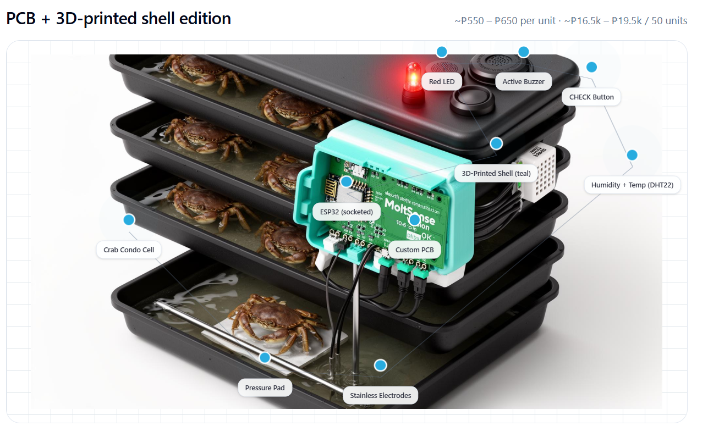
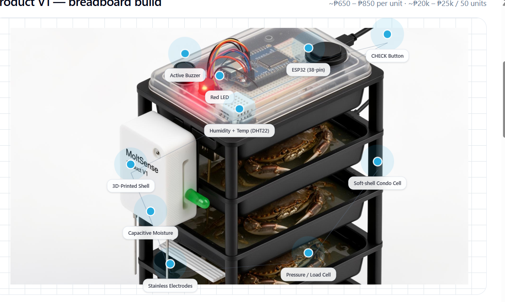

# MoltSense


MoltSense is a smart molt detection system for soft-shell crab farms. The platform pairs ESP32 sensor pods with a farmer-first dashboard that highlights weight, molt timing, and actionable insights without exposing raw sensor noise.

## Product Diagrams

### PCB + 3D-Printed Shell (compact)


### Product V1 - Breadboard Build


Both builds use the same core components; the PCB variant is the final compact target.

## Project Summary

MoltSense monitors crab condos (cells) organized in vertical racks and horizontal sets. ESP32 devices register on boot, stream sensor data, and trigger physical alerts. The dashboard mirrors the real layout with a visual grid, recent activity, and per-cell history.

Key goals:

- detect molts via conductivity + pressure sensors
- alert locally (buzzer + LED) and remotely (dashboard)
- allow manual acknowledgment through hardware or the dashboard
- keep history + analytics to optimize feeding and harvest timing

## Core Features

- ESP32 registration flow (undiscovered devices -> assign to set/rack/cell)
- visual grid of sets/racks/cells for at-a-glance mapping
- drag-and-drop reordering for racks and cells
- farmer-friendly metrics (weight + molt timing)
- LED toggle from the dashboard
- per-cell history page at /cell/[id]/history
- farm-wide molt history table with set/rack context
- analytics report preview + CSV export

## Hardware Components

- ESP32 microcontroller
- stainless electrodes (conductivity)
- pressure / load cell pad
- DHT22 temperature + humidity sensor
- buzzer + LED + acknowledge button

## UI/UX Highlights

- Weight shown in g/kg/lb (raw pressure retained internally)
- Temperature toggle C/F
- Molt timing phrased in farmer language
- Dedicated history page to keep popups lightweight

## Repository Structure

```text
app/
	dashboard/
	my-racks/              # My Sets
	my-cells/              # device discovery
	molt-history/
	analytics/
	cell/[id]/history/
components/
	dashboard/
	my-racks/
	cell-history/
	analytics/
lib/
	localStorage.ts        # demo persistence
	utils.ts               # unit conversions
public/
	docs/
```

## Routes

- /dashboard
- /my-racks (My Sets)
- /my-cells (Discover)
- /molt-history
- /analytics
- /cell/[id]/history

## Data Notes

This demo uses localStorage for persistence. It is structured so a real backend can replace the storage layer later.

## Getting Started

```bash
npm install
npm run dev
```

Open http://localhost:3008

## Scripts

```bash
npm run dev
npm run build
npm run start
npm run lint
npx tsc --noEmit
```
